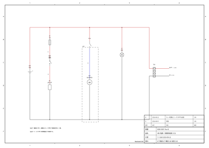

<div align="center">

<picture>
  <source media="(prefers-color-scheme: dark)" srcset="docs/images/logo-dark.svg">
  
</picture>

# MadakeCAD

**AI-firstな産業設備向け電気CAD — JIS / IEC / ISO 準拠を目指して**

ロボット・機械・制御盤の規格準拠配線図を作図 —
AIアシスタントは人間と同じundo可能なコマンドエンジンで編集し、
検証は実回路ソルバ(ngspice)の解に基づく。

[](https://github.com/kousuke-takeuchi/MadakeCAD/actions/workflows/ci.yml)
[](docs/13-specification.ja.md)

-lightgrey)


[](#ライセンス)

[概要](docs/01-overview.ja.md) · [はじめに](docs/02-getting-started.ja.md) · [ドキュメント](#ドキュメント) · [詳細仕様](docs/13-specification.ja.md) · [ロードマップ](docs/12-roadmap.ja.md) · [English](README.md)



*MadakeCADで出力した図面: ゾーン番号・表題欄付きJIS A3図枠*

</div>

---

## なぜMadakeCADか

- 🏭 **基板CADは設備配線に不向き** — 規格図枠(JIS/ISO)・電線品番管理・端子台中心の結線・電線リストが無い
- 💰 **産業用CAD(AutoCAD Electrical・EPLAN)はクローズドで重い** — AI統合も無い
- 🤝 **熟練が入場券であってはならない** — LLMを介せば非熟練者も正しい図面を作れ、ベテランは速い慣習的CAD操作をそのまま使える

## 特徴

- ✏️ **専用回路図エディタ** — JIS C 0617シンボル、ピン数可変端子台/コネクタ(1〜50極)、直交配線+グリッド/ピンスナップ、参照記号自動採番、複数シート、レイヤ
- 📐 **規格に忠実な出力** — 現状はJIS図枠(ゾーン・表題欄)、IEC 60617 / IEC 81346 / ISO 7200系はロードマップ。日本語フォント埋め込みの印刷品質SVG/PDF、部品表・電線リストCSV
- ✅ **ソルバ裏付けの検証** — ERC+電気チェック(到達性・許容電流・電圧降下・ヒューズ定格)をngspiceのDC解で判定
- ⚡ **DCシミュレーション** — ネット電圧・部品電流/電力、スイッチ開閉のwhat-if
- 🗄️ **部品データベース** — 定格・購入先リンク付きローカルSQLiteマスタ+電線品番マスタ。配置で定格が自動設定
- 🤖 **AIアシスタント内蔵** — チャットがMCP経由で作図・編集。AIのターンは全てundo可能、編集領域をライブ表示
- 🔌 **全部自動化できる** — MCPサーバー・REST API+SSE・`madake` CLIが同じコマンドエンジンを駆動

## クイックスタート

前提: [Rust](https://rustup.rs)、Node.js 20+。任意: [ngspice](https://ngspice.sourceforge.io/)(回路解析検証)、[Claude Code](https://claude.com/claude-code)(AIチャット)。

```bash
git clone <このリポジトリ>
cd MadakeCAD
npm install
npm run tauri dev
```

詳細な手順・任意コンポーネント・トラブルシューティング: **[はじめに](docs/02-getting-started.ja.md)**

## ドキュメント

読み順に連番が振ってあります:

| # | ドキュメント | 内容 |
|---|---|---|
| 01 | [概要](docs/01-overview.ja.md) | MadakeCADとは・存在理由・設計目標 |
| 02 | [はじめに](docs/02-getting-started.ja.md) | インストール・ビルド・起動・トラブル対処 |
| 03 | [回路図エディタ](docs/03-schematic-editor.ja.md) | キャンバス・ツール・シンボル・シート・レイヤ |
| 04 | [規格・出力](docs/04-standards-output.ja.md) | JIS図枠・PDF/SVG・部品表・電線リスト |
| 05 | [電線管理](docs/05-wire-management.ja.md) | 線色・線径・品番・ハーネス |
| 06 | [検証・シミュレーション](docs/06-verification-simulation.ja.md) | ERC・電気チェック・DC解析 |
| 07 | [部品データベース](docs/07-parts-database.ja.md) | 部品マスタ・定格・購入先 |
| 08 | [インポート/エクスポート](docs/08-import-export.ja.md) | KiCadインポート・ファイル形式 |
| 09 | [AIアシスタント](docs/09-ai-assistant.ja.md) | チャット作図・ターン単位undo・プロバイダ |
| 10 | [自動化・API](docs/10-automation-api.ja.md) | MCPツール・REST API・CLI |
| 11 | [機械CAD連携](docs/11-mechanical-integration.ja.md) | FreeCAD連携 |
| 12 | [ロードマップ](docs/12-roadmap.ja.md) | マイルストーンM1〜M6 |
| 13 | [詳細仕様設計書](docs/13-specification.ja.md) | **テストスイートから自動生成** — 全項目が機械検証済み |

各ページは英語が正本(`.md`)で日本語版(`.ja.md`)を併設。開発者向け内部資料(アーキテクチャ・データモデル・機能仕様・デザインシステム)は[`docs/internal/`](docs/internal/README.md)。

## アーキテクチャ(一行で)

```
UI · AIチャット · CLI · REST  →  Command(JSON)  →  エンジン(Rust)  →  patch  →  全クライアントへ即時反映
```

どの入口の編集も単一エンジンへのundo可能なコマンド — これがAI編集を安全にする仕組み。詳細: [internal/architecture.md](docs/internal/architecture.md)

## ステータスとロードマップ

**アルファ版。** マイルストーンM1(基盤)は概ね完了。M2(参考図面の完全再現)〜M6(OSS公開)は[ロードマップ](docs/12-roadmap.ja.md)参照。Tauri 2 + Vue 3 + Rust製。

## コントリビュート

docs-first・design-first(Pencil)・TDDのワークフロー。[`docs/internal/`](docs/internal/README.md)から(アーキテクチャ・変更レシピ・機能仕様が揃っています)。ドキュメントは英語が正本、日本語版は`*.ja.md`。

## ライセンス

以下のいずれかを選択できます(デュアルライセンス):

- Apache License 2.0([LICENSE-APACHE](LICENSE-APACHE))
- MITライセンス([LICENSE-MIT](LICENSE-MIT))

明示的な表明がない限り、このプロジェクトへ意図的に提出されたコントリビュートは、追加条件なしに上記デュアルライセンスで提供されるものとします。
