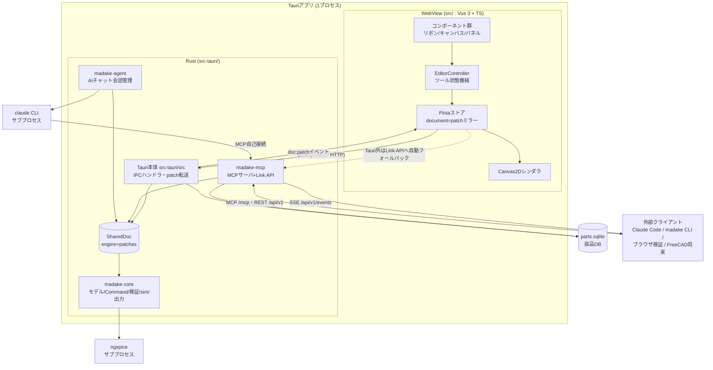
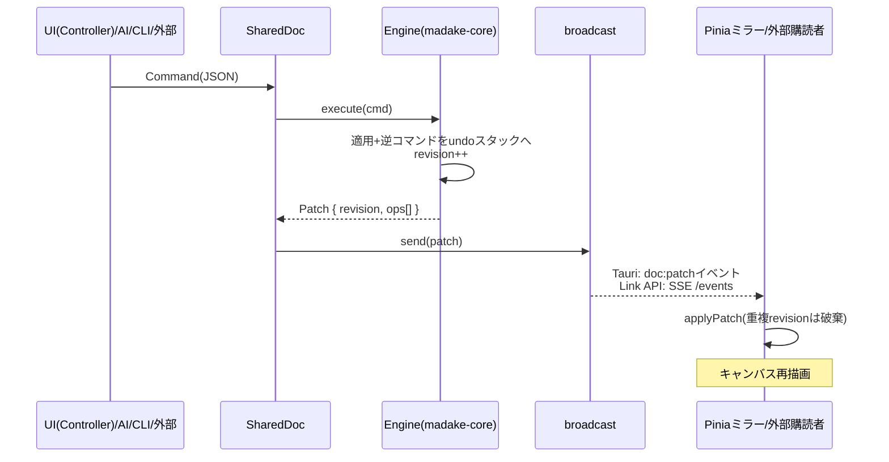
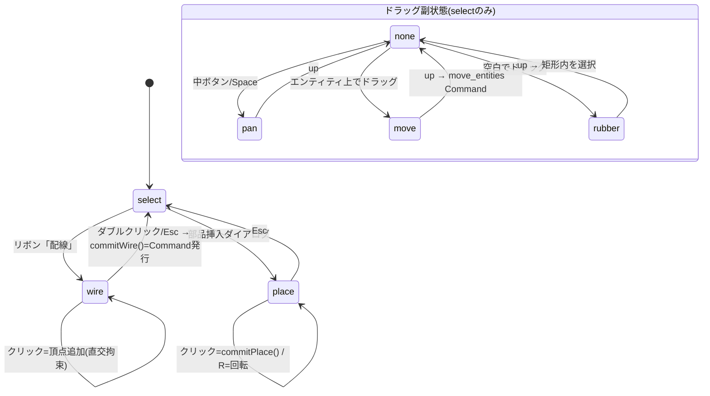
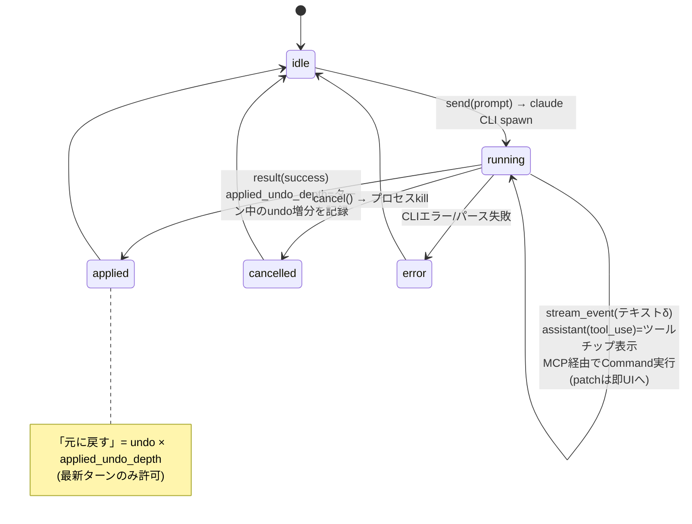

# システム設計書(アーキテクチャ)

作成: 2026-08-21。**ソースコードを修正する人向けの全体像**。データ構造は[データ設計書](data-model.md)、依存の選定理由は[技術スタック](tech-stack.md)。

## 1. システム構成



**絶対原則**: ドキュメントへの全編集は`Command`として`Engine::execute()`を通す。
入口がUI/AI/CLI/外部APIのどれでも、`SharedDoc`(engine+patch broadcast)に合流するので、undo/redo・リアルタイム反映・rev番号が常に一貫する。

## 2. クレート・依存関係

```
madake-cad (Tauri本体) ──┬──> madake-mcp ──┬──> madake-core   (UI非依存。ロジックは原則ここ)
                          │                 └──> madake-agent ──> (claude CLIをspawn)
                          ├──> madake-agent
                          └──> madake-core
madake-cli (独立バイナリ) ──> reqwestでLink APIを叩くだけ(コアに依存しない薄いクライアント)
```

依存は一方向(core←mcp←cad)。coreはTauri/axum/rmcpを知らない。

## 3. フォルダ・ファイルマップ

### Rust: `src-tauri/crates/madake-core`(ドメインの心臓部)

| ファイル | 責務 |
|---|---|
| `model.rs` | Project/Sheet/Entity(Symbol・Wire・Junction・NetLabel・Text)、表題欄・改訂欄 |
| `command.rs` | `Command` enum(全編集操作)+`Engine`(execute/undo/redo、Patch生成、revision) |
| `geometry.rs` | Point(mm) |
| `symbol.rs` | 静的シンボル13種+動的生成(`connector_{n}p`/`terminal_block_{n}p`)、`resolve_symbol`/`sheet_symbol_defs` |
| `netlist.rs` | 接続グラフ抽出(座標一致・Junction・ラベル統合・端子台貫通)、`transform_local`(回転/ミラー) |
| `verify.rs` | ERC+電気検証→`Diagnostic`。ngspice実解優先、近似フォールバック |
| `spice.rs` | 図面→SPICEデッキ(接続点ノード・ワイヤ=抵抗・分割按分・開路what-if) |
| `ngspice.rs` | ngspice探索(env→PATH→OS既定)+`-b`実行+出力パース |
| `sim.rs` | DC動作点のユーザー向け結果(`SimOpResult`) |
| `svg.rs` | JIS図枠+全エンティティのSVG出力(印刷品質の正) |
| `pdf.rs` | SVG→PDF変換(svg2pdf、フォント埋め込み) |
| `reports.rs` | BOM CSV・電線リストCSV |
| `parts.rs` | 部品DB(SQLite、schema_version管理+マイグレーション) |
| `kicad.rs` | S式パーサ+`.kicad_sch`→Project変換(`ImportReport`) |
| `io.rs` | `.mdkproj`の保存/読込 |

### Rust: その他クレート

| 場所 | 責務 |
|---|---|
| `madake-mcp/lib.rs` | `SharedDoc`(engine+patch broadcast)、MCPツール定義(rmcp)、`serve()`(9310で/mcpと/api/v1を同居) |
| `madake-mcp/link_api.rs` | Link API(REST+SSE)。CORS/オリジンガード。全書き込みはSharedDoc経由 |
| `madake-mcp/agent.rs` | SharedDoc⇔madake-agentのブリッジ、保存/読込/KiCadインポート(チャット履歴込み) |
| `madake-agent/backend.rs` | `AgentBackend`トレイト+ClaudeCodeCliBackend(claude -p、stream-jsonパース) |
| `madake-agent/manager.rs` | 会話マネージャ(ターン実行・キャンセル・undo深さ追跡) |
| `madake-agent/conversation.rs` `events.rs` `settings.rs` | 会話モデル・イベント配信・AI設定 |
| `madake-cli/` | `madake`コマンド。`cli.rs`=引数/ディスパッチ、`client.rs`=HTTP、`format.rs`=人間向け整形 |
| `src-tauri/src/lib.rs` | Tauri IPCハンドラ(#[tauri::command]群)、MCPサーバ起動、patch→`doc:patch`転送、部品DB起動時オープン |

### フロント: `src/`

| 場所 | 責務 |
|---|---|
| `ipc.ts` | 通信の一枚岩。型定義(Command/Patch/Entity/Diagnostic…)+`Ipc`インタフェース。**Tauri内=invoke、ブラウザ=Link API**の2実装を自動切替 |
| `stores/document.ts` | **patchミラー**(唯一の真実はRust側。patchだけ適用、直接変更禁止)。選択・アクティブシート |
| `stores/ui.ts` | UI状態(ダイアログ開閉・左パネルタブ・表示クラス・ログ) |
| `stores/verification.ts` `simulation.ts` `parts.ts` `chat.ts` `settings.ts` | 各機能の取得結果・パネル状態 |
| `tools/controller.ts` | **ツール状態機械**(select/wire/place)。ポインタ/キー入力→ローカルプレビュー→確定時にCommand発行。reveal(選択+ズーム) |
| `canvas/renderer.ts` | 純関数レンダラ(グリッド・図枠・エンティティ・選択・表示クラスフィルタ) |
| `canvas/viewport.ts` | mm⇔px変換・ズーム・スナップ |
| `canvas/dynamicSymbol.ts` | 動的シンボルのTS版生成(Rustと座標一致、テストで突き合わせ) |
| `canvas/viewClasses.ts` | 表示クラス(レイヤ)定義 |
| `canvas/agentOverlay.ts` `theme.ts` | AI編集領域パルス・色トークン |
| `components/` | 画面部品(EditorLayoutが全体、CanvasViewが描画ループ+入力、他は一覧表=ui-screens廃止につき`MadakeCAD.pen`参照) |
| `composables/` | ファイル操作(fileActions)・ポップオーバー・チャット入力 |

## 4. 編集のデータフロー(シーケンス)

どの入口でも同じ経路を通る:



undo/redoも同経路(`Engine::undo()`が逆Patchをbroadcast)。

## 5. 状態遷移図

### 5.1 エディタツール(`tools/controller.ts`)



ポイント: ドラッグ中は**ローカルプレビューのみ**(store未変更)。確定(pointerup/確定操作)で初めてCommandを発行する。

### 5.2 AIチャットのターン(`madake-agent`)



### 5.3 Engineの履歴

```
execute(cmd) ─► undoスタックにpush、redoスタックをクリア
undo()       ─► undoからpop→逆適用→redoへpush
redo()       ─► その逆
revision     ─► execute/undo/redoすべてで単調増加(ミラーの重複排除キー)
```

## 6. 変更レシピ(よくある修正はどこupdate)

| やりたいこと | 触る場所(順) |
|---|---|
| 新しい編集操作 | `command.rs`にCommand追加(applyで逆コマンドを返す)→ 必要ならMCP/CLIはそのまま`execute_commands`/`exec`で使える → UIから使うならipc経由でstore.execute |
| 新しいシンボル | 静的: `symbol.rs`の`builtin_symbols()`。動的パターン追加: `dynamic_symbol()`+TS側`canvas/dynamicSymbol.ts`(両方のテストで座標突き合わせ) |
| 新しい検証ルール | `verify.rs`(ercまたはelectrical)+テスト。コード体系は`erc.*`/`elec.*` |
| 新しいMCPツール | `madake-mcp/lib.rs`の`#[tool]`メソッド追加(paramsはschemars導出) |
| 新しいLink APIエンドポイント | `link_api.rs`にハンドラ+route追加。統合テストは`tests/link_export.rs`方式(Routerへ直接oneshot) |
| 新しいCLIサブコマンド | `madake-cli/cli.rs`(enum+dispatch)+`client.rs`(LinkApiトレイト)+`format.rs`+FakeApi更新 |
| 新しいTauri IPC | `src-tauri/src/lib.rs`に`#[tauri::command]`+invoke_handler登録+`src/ipc.ts`両実装(invoke/HTTP) |
| 新しいUIパネル/画面 | **先に`MadakeCAD.pen`でデザイン**(不足部品はDSボードへ)→ design-system.md記載 → コンポーネント+ストア実装 → ブラウザ(1420)で実機検証 |
| 出力(SVG/PDF)の見た目 | `svg.rs`(正)+画面側は`renderer.ts`(両者は同じルールを二重実装。片方だけ変えない) |
| `.mdkproj`のフィールド追加 | `model.rs`(serde default必須)→`format_version`検討→`io.rs`→ TS型(`ipc.ts`) |
| 部品DBの列追加 | `parts.rs`: SCHEMA_VERSION++、CREATE文とmigrate()、Part構造体、テスト |

## 7. テストの置き場所

| 対象 | 場所 | 実行 |
|---|---|---|
| コアロジック | 各`.rs`の`#[cfg(test)]`(madake-coreに集中) | `cd src-tauri && cargo test` |
| Link API統合 | `madake-mcp/tests/link_export.rs`・`agent_api.rs`(サーバ不要、Router直呼び) | 同上 |
| AIチャット | `madake-agent/tests/`(claudeはフェイクスクリプト) | 同上 |
| フロントの純ロジック | `src/**/*.test.ts`(ストア・dynamicSymbol・viewport等) | `npx vitest run` |
| UIの見た目・操作 | ブラウザ http://localhost:1420 (実バックエンド接続) | 手動/ブラウザ自動化 |
| ngspice実機 | 検出時のみ走るテスト(未導入環境ではスキップ) | 同上 |
