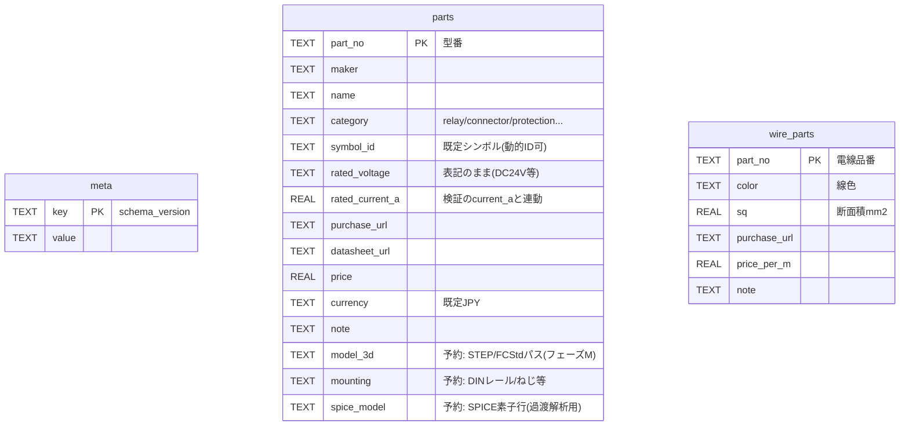

# データ設計書

作成: 2026-08-21。実装の正は`madake-core/src/model.rs`(ドキュメント)と`madake-core/src/parts.rs`(部品DB)。

MadakeCADの永続データは3系統ある:

| データ | 形式 | 場所 | マスタ権 |
|---|---|---|---|
| 図面ドキュメント | `.mdkproj`(整形JSON) | ユーザーが選ぶパス | 図面の全て(自己完結) |
| 部品DB | SQLite | アプリデータdir `MadakeCAD/parts.sqlite`(`MADAKE_PARTS_DB`で変更可) | 部品・電線品番のマスタ |
| チャット履歴 | `<プロジェクト名>.chat.json` | `.mdkproj`の隣 | AI会話 |

## 1. 図面ドキュメント(.mdkproj)

`format_version: 3`(2026-09-27。1→2でPLC割付表、2→3で`mech_links`と`Wire.length_source`を追加。旧版は既定値で開ける)。構造(mermaid classDiagram):

```mermaid
classDiagram
    Project "1" *-- "1..*" Sheet
    Project "1" *-- "*" WirePart : wire_partsスナップショット
    Project "1" *-- "*" MechLink : mech_links(FreeCAD対応付け)
    Sheet "1" *-- "1" TitleBlock
    Sheet "1" *-- "*" Revision
    Sheet "1" *-- "*" Entity : entities(BTreeMap[Uuid,Entity])
    Entity <|-- SymbolInstance
    Entity <|-- Wire
    Entity <|-- Junction
    Entity <|-- NetLabel
    Entity <|-- TextEntity

    class Project {
      format_version: u32
      name: String
    }
    class Sheet {
      id: Uuid
      name: String
      size: A4|A3|A2|A1|A0
      orientation: Landscape|Portrait
      zone_cols / zone_rows: u32
    }
    class TitleBlock {
      company / title / drawing_no / scale / date
      designed / drawn / checked / approved / rev
    }
    class Revision {
      mark / date / description / by
    }
    class SymbolInstance {
      id: Uuid
      symbol_id: String  %% 静的id or connector_{n}p / terminal_block_{n}p
      at: Point(mm)
      rotation: 0|90|180|270
      mirror: bool
      reference: String  %% "K1"
      value: String      %% 型番
      attrs: Map~String,String~  %% current_a等
    }
    class Wire {
      id: Uuid
      points: Point[]    %% 直交ポリライン
      color: String
      sq: f64            %% mm2
      length_m: f64?
      length_source: manual|freecad  %% 長さの出所(M5-2)
      part_no: String?
      net: String?
    }
    class MechLink {
      entity_id: Uuid     %% シンボル/配線のid。FreeCAD側はmadake_idプロパティ
      fcstd_path: String
      object_name: String
      synced_at: String   %% ISO 8601
    }
    class Junction { id; at: Point }
    class NetLabel { id; at: Point; name; rotation }
    class TextEntity { id; at: Point; text; height; rotation }
```

規約:

- 座標は**mm・左上原点・Y下向き**。ピン/端点は2.5mmグリッド上(接続判定の許容誤差0.01mm)
- Entityは`kind`タグ付きJSON(serde tagged enum)
- **編集は必ずCommand経由**(add_entity / update_entity / remove_entity / move_entities / add_sheet / set_title_block等)。Commandスキーマの正は`madake-core/src/command.rs`(MCPの`execute_commands`入力スキーマとして自動公開)
- 派生データ(保存されない): ネットリスト・SPICEデッキ・診断・シミュレーション結果は都度計算

## 2. 部品DB(parts.sqlite)

`schema_version: 2`(metaテーブルで管理。旧バージョンは起動時にマイグレーション)。



- partsとwire_partsに外部キー関係はない(図面側は型番文字列で参照するスナップショット方式。DBを消しても図面は自己完結)
- 新規作成時のみサンプル(ダミー型番 MDK-*)を投入
- 図面との連携: 部品挿入ダイアログで選択→`SymbolInstance.value=part_no`、`attrs.current_a=rated_current_a`

## 3. チャット履歴(.chat.json)

`format_version`付き。会話の配列(各会話: id・タイトル・messages)。メッセージはターンごとに
`applied_undo_depth`(そのターンでドキュメントに積まれたundo段数)を持ち、「ターンを元に戻す」はundo N回と等価。
詳細は`madake-agent`クレートと`docs/superpowers/plans/2026-08-20-phaseA1-ai-chat-and-cli.md`。

## 4. 派生データの型(保存されない)

| 型 | 生成元 | 用途 |
|---|---|---|
| `Net { name, pins[], wire_ids[] }` | netlist.rs | BOM/電線リスト/検証/表示 |
| `Diagnostic { severity, code, message, sheet_id, entity_ids }` | verify.rs | 検証結果パネル・CLI・MCP |
| `SpiceDeck` | spice.rs | ngspice入力(ワイヤ=抵抗、ノード=接続点クラスタ) |
| `SimOpResult { voltage, nets[], components[] }` | sim.rs | シミュレーション結果パネル |
| `ImportReport` | kicad.rs | KiCadインポートの要約 |
| `Patch { revision, ops[] }` | command.rs | UI/クライアントへの差分配信(SSE `/api/v1/events`・Tauri `doc:patch`) |
