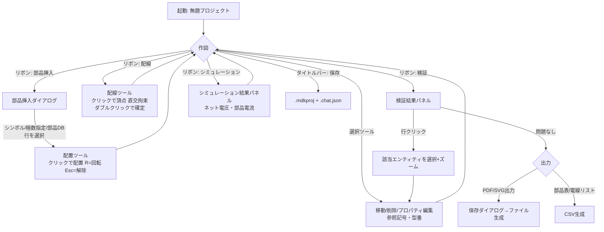
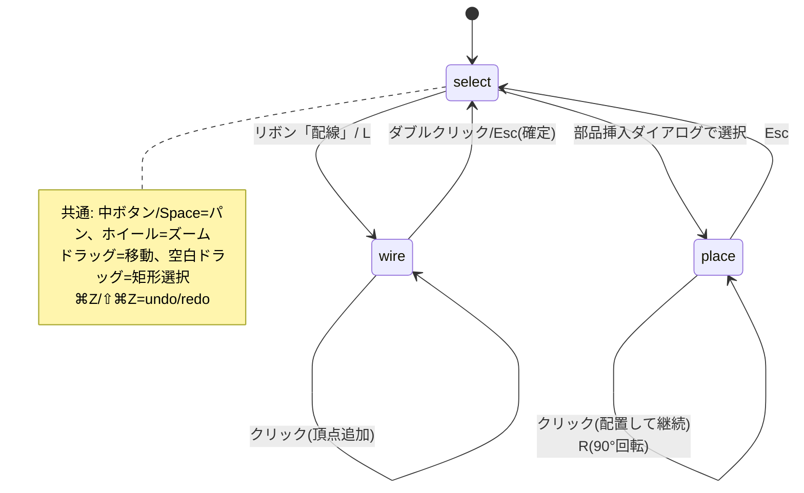
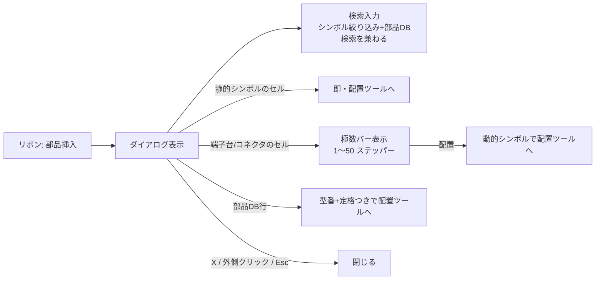
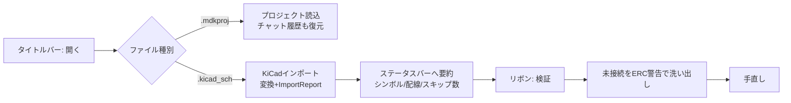
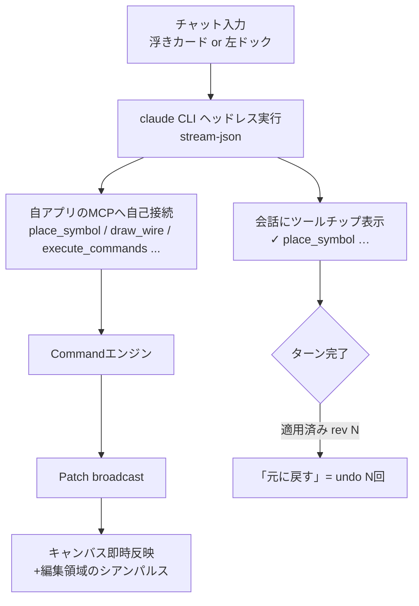
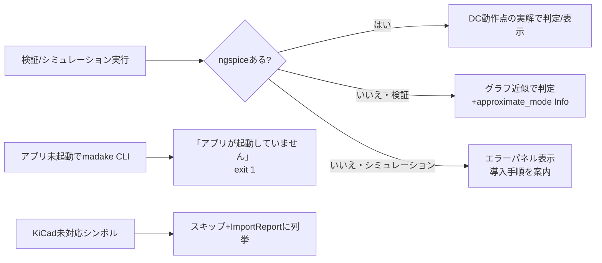

# 画面遷移図・ユーザーフロー

作成: 2026-08-21。画面の詳細は[画面設計書](ui-screens.md)。

## 1. 基本作図フロー(作図→検証→出力)

## 2. ツールの状態遷移(キャンバス)

## 3. 部品挿入ダイアログ内の分岐

## 4. KiCad移行フロー

## 5. AI編集フロー(チャット)

## 6. エラー・例外フロー

## 7. 外部クライアントの入口(遷移図の外側)

| 入口 | 経路 | 備考 |
|---|---|---|
| Claude Code / Desktop | MCP `127.0.0.1:9310/mcp` | `.mcp.json`で自動接続 |
| madake CLI | Link API `/api/v1` | 全編集はCommand経由なのでUIと同じundo履歴に乗る |
| ブラウザ(UI検証) | `http://localhost:1420` → Link API | Tauri外ではipcが自動フォールバック |
| FreeCADアドオン(将来) | Link API `/api/v1` | spec §7 |
